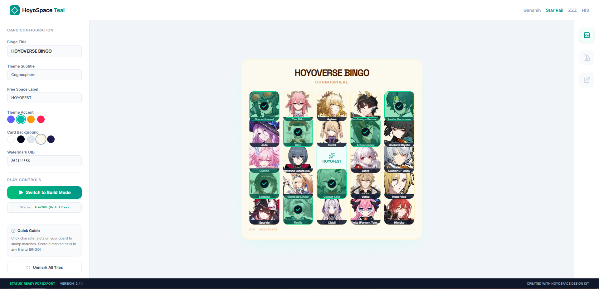

# Hoyoverse Character Bingo

An interactive, high-fidelity Bingo card generator and tracker for HoYoverse games. Easily generate custom, randomized 5x5 boards populated with your favorite characters, mark completed tiles, track active winning combinations, and explore comprehensive roster databases.

 

## 🌟 Key Features

* **Interactive Bingo Board (5x5)**:
  * Generates completely randomized character layouts across supported games.
  * Interactive tile tracking with visual activation states, custom-colored themes, and fallback icons.
  * Automatic win-checking for horizontal, vertical, and diagonal lines.
  * Real-time Bingo celebration animations and counter.

* **Multi-Game Support & Deep Roster Integration**:
  * **Honkai: Star Rail**: Expanded to support up to mid-2026 characters across all Paths (**The Destruction**, **The Hunt**, **The Erudition**, **The Harmony**, **The Nihility**, **The Preservation**, **The Abundance**, **The Remembrance**, and **The Elation**).
  * **Zenless Zone Zero**: Completely updated with characters categorized by their active **Factions** (e.g., Cunning Hares, Victoria Housekeeping Co., Belobog Heavy Industries, Sons of Calydon, Criminal Investigation Special Response Team, Section 6, and many more).
  * **Genshin Impact**: Organized by the active **Regions** of Teyvat (Mondstadt, Liyue, Inazuma, Sumeru, Fontaine, Natlan, etc.).
  * **Honkai Impact 3rd**: Supports iconic characters and specialized alternate forms (e.g., Senti, Veliona).

* **Advanced Filtering & Search Interface**:
  * Filter rosters globally by game (All, Genshin Impact, Honkai: Star Rail, Zenless Zone Zero, Honkai Impact 3rd).
  * Dynamic, game-specific sub-filtering:
    * **Genshin Impact**: Filter by Teyvat Regions.
    * **Honkai: Star Rail**: Filter by gameplay Paths (Destruction, Hunt, Harmony, etc.).
    * **Zenless Zone Zero**: Filter by New Eridu Factions.
  * Real-time character search by name.

* **High-Contrast Design & Themes**:
  * Clean, ambient slate aesthetic utilizing generous spacing and responsive layout grids.
  * Animated board transitions and micro-interaction effects powered by `motion`.
  * Automatic smart image scraping from fandom assets with fallback color placeholders.

## 🛠️ Tech Stack

* **Frontend Framework**: React 18+ with TypeScript
* **Build Tooling**: Vite
* **Styling**: Tailwind CSS
* **Animation**: `motion` (imported from `motion/react`)
* **Icons**: `lucide-react`

## 🚀 Getting Started

### Prerequisites

* Node.js (v18 or higher recommended)
* npm or yarn

### Installation

1. Install project dependencies:
   ```bash
   npm install
   ```

2. Run the development server:
   ```bash
   npm run dev
   ```

3. Build the application for production:
   ```bash
   npm run build
   ```

4. Start the production server:
   ```bash
   npm run start
   ```

## 📂 Project Structure

```text
├── src/
│   ├── components/
│   │   └── HoyoverseImage.tsx   # Fetches/displays high-fidelity character illustrations
│   ├── App.tsx                  # Core layout, state managers, and Bingo validation engine
│   ├── data.ts                  # Comprehensive roster databases, categories, and themes
│   ├── index.css                # Global CSS directives & Tailwind imports
│   └── main.tsx                 # App entry point
├── index.html                   # HTML Entry template
├── metadata.json                # Project configuration and capabilities
└── package.json                 # Dependency manifests and scripts
```
